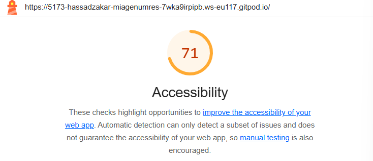
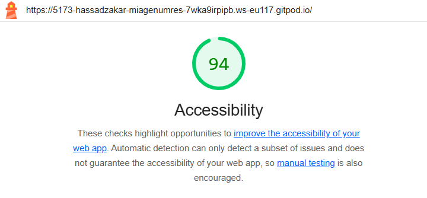
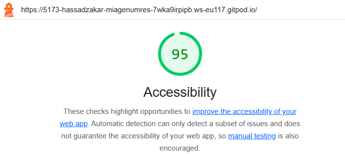
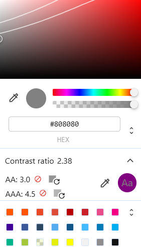
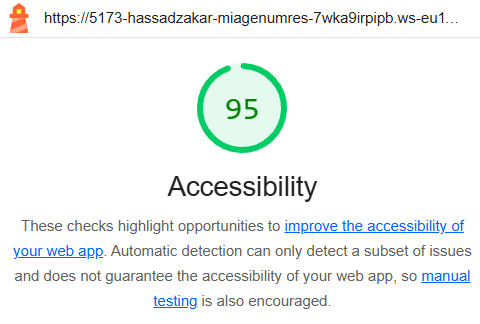
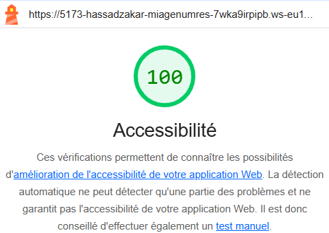

# Q1: Quels sont les arguments que vous pouvez utiliser pour convaincre votre Client de rendre son quizz accessible ? (Vous pouvez vous aider du cour)
Réponse:
1. Inclusivité et égalité des chances
Un quiz accessible permet à tous les utilisateurs, y compris ceux ayant des handicaps (visuels, auditifs, cognitifs ou moteurs), d’y participer. Cela reflète une valeur fondamentale d’inclusion et d’égalité, ce qui renforce l’image de l’entreprise.
2. Augmentation du public cible
En rendant le quiz accessible, vous élargissez le public pouvant interagir avec votre contenu. Plus de participants signifie une plus grande visibilité, un impact plus important, et potentiellement plus de clients ou d’utilisateurs fidèles.

# Q2: Ajouter le screen de votre score :
Screen:

# Q3: Est-ce que l'analyse de Lighthouse est suffisante pour évaluer l'Accessibilité de votre Application ?
Réponse:
Non, l’analyse de Lighthouse n’est pas suffisante pour évaluer complètement l’accessibilité. 
# Q4: Combien de fois vous devez utiliser une touche du clavier pour passer le quizz ?
Réponse:
33
# Q5: Donner 3 roles ARIA et 3 propriété ARIA
Réponse:
Les propriétés ARIA enrichissent l’accessibilité des éléments, par exemple aria-label pour ajouter une description accessible, aria-hidden pour cacher un élément aux lecteurs d’écran, et aria-expanded pour indiquer si un élément interactif est déployé ou replié. Les rôles ARIA permettent de définir le comportement des éléments pour les technologies d’assistance, comme role="button" pour indiquer un bouton, role="alert" pour signaler des messages importants, et role="navigation" pour structurer une zone de navigation. 
# Q6: Ajouter le screen de votre score Lighthouse
Screen:

# Q7: L'une des best practice de l'ARIA est "ne pas utiliser l'ARIA" pouvez nous expliquer pourquoi d'après vous ?
Réponse:
Les éléments HTML sémantiques sont automatiquement pris en charge par les navigateurs et les lecteurs d'écran. Par exemple, un <button> natif apporte automatiquement le rôle button et gère les événements clavier. Si on utilise un 
 avec role="button", il faut ajouter manuellement tout le comportement lié à un bouton. Cela crée des risques d'erreurs et une maintenance plus complexe.
Code plus simple et maintenable : Utiliser HTML natif au lieu de ARIA réduit la complexité du code, rendant le développement plus rapide et évitant les redondances inutiles.
# Q8: Ajouter le screen de votre score Lighthouse
Screen:

# Q10: Quel est la valeur du rapport de contraste actuel :
Réponse:
   2.38
# Q11: Quel est la valeur du score AA :
Réponse:
3.0
# Q12: Quel est la valeur du score AAA :
Réponse:
4.5
# Q13: Comment pouvez vous changer la valeur du contraste de votre texte ?
Réponse:
Modifier les couleurs utilisées :
 
Choisir une couleur de texte et une couleur de fond qui respectent un ratio de contraste minimum de 4.5:1 pour le niveau AA ou 7:1 pour le niveau AAA.
Utiliser des thèmes ou des palettes prédéfinis :

Privilégier des combinaisons de couleurs accessibles dès la conception.
# Q14: Ajouter le screen de votre score Lighthouse
Screen:

# Q15: Êtes vous capable de déterminer visuellement ce qui est un lien ou pas en appliquant chaque altérations ?
Réponse:
Nn
# Q16: Ajouter le screen de votre score Lighthouse
Screen:

# Q17:  Proposition 1
Description:
Nb d'actions gagnée : 

# Q18:  Proposition 2
Description:
Nb d'actions gagnée : 

# Q19:  Proposition 3
Description:
Nb d'actions gagnée : 
